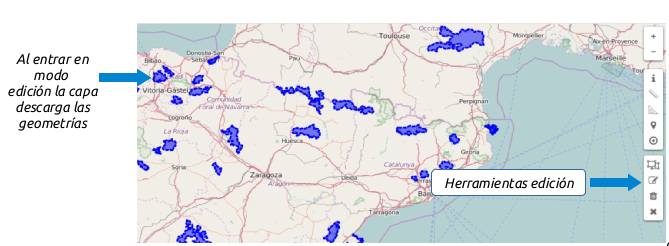
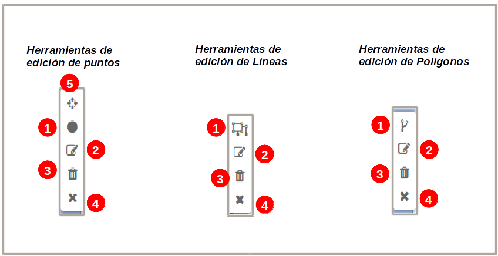

Editar capa
===========

.. note::
   Esta acción requiere que el usuario pertenezca a un grupo con permisos de escritura.

Para poner una capa en modo de edición seleccionamos en el menú de acciones la entrada *"Editar capa"*.

Al comenzar la edición se añade al mapa una nueva barra de herramientas de edición, en función del tipo de geometría de la capa ya sea punto, linea o polígono.

La barra de herramientas de edición dispone de 4 herramientas:

Añadir un nuevo elemento a la capa
----------------------------------
Para añadir un nuevo elemento seleccionamos la herramienta de dibujo y a continuación procedemos a dibujar el elemento sobre el mapa (punto, linea o polígono). 

Una vez dibujado elemento aparecerá en la barra de navegación un formulario para que introduzcamos los valores de los atributos del elemento.

.. image:: ../images/edition3.png
   :align: center
   
Si deseamos adjuntar cualquier archivo multimedia podemos realizarlo desde la pestaña *"Recursos del elemento"*.

Una vez hemos rellenado el formulario seleccionaremos el botón *"Guardar"*. En ese momento el nuevo elemento y los recursos asociados serán persistidos en la base de datos.
Si presionamos el botón *"Cancelar"* la geometría será eliminada del mapa y se cerrará el formulario.

Modificar un elemento existente
-------------------------------
Seleccionaremos la herramienta de modificar elementos en la barra de edición. A continuación seleccionaremos el elemento sobre el mapa. Una vez hayamos seleccionado el elemento podremos editar su geometría seleccionando y moviendo
los vértices en caso de ser linea o polígono, o desplazando el elemento en caso de ser un punto.

También se desplegará en la barra de navegación un formulario con el valor de los atributos del elemento.

Una vez hayamos terminado de modificar la geometría y/o datos alfanuméricos del elemento procederemos como en el apartado anterior seleccionando el botón *"Guardar"* o *"Cancelar"*.

Eliminar un elemento existente
------------------------------
Seleccionaremos la herramienta de eliminar elementos en la barra de edición. A continuación seleccionaremos el elemento que deseamos eliminar sobre el mapa. 

Una vez hayamos seleccionado el elemento se desplegará en la barra de navegación un formulario con el valor de los atributos del elemento.

En esta ocasión dispondremos del botón *"Eliminar"*, el cual eliminará el elemento del mapa y de la base de datos.