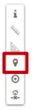
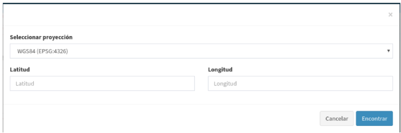

Buscar por coordenadas
======================
La modalidad de búsqueda inversa nos permite buscar una localización a partir de unas coordenadas dadas.

Para proceder a la búsqueda inversa, en primer lugar debemos seleccionar el sistema de referencia en el que introduciremos las coordenadas. Los sistemas de coordenadas vendrán predefinidos para cada aplicación.

Una vez hayamos seleccionado el sistema de coordenadas, introduciremos los valores para la longitud y latitud en caso de ser un sistema con coordenadas geográficas o X/Y
en caso de ser un sistema con coordenadas proyectadas.

