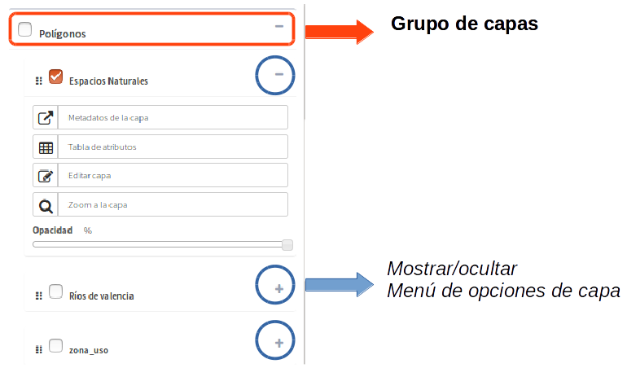
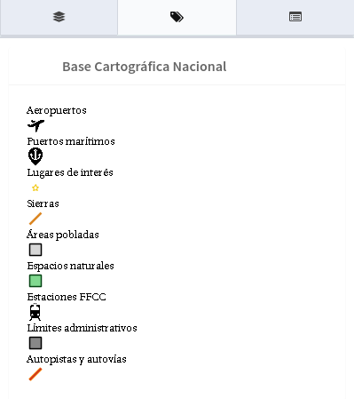

Introducción
============

El visor de mapas es la interfaz de visualización de la plataforma que permite la visualización de los proyectos configurados desde el panel de control.  

.. image:: ../images/viewer1.png
   :align: center

Está formado por una serie de componentes los cuales están ubicados en una zona específica de la página web (Mapa, menú superior, panel de contenidos, controles).

Mapa
----
El mapa es el área principal de visualización de los datos. 

Contiene una serie de controles ubicados en distintas zonas:

* Escala y posición en la parte inferior izquierda.

* Mapa de referencia en la parte inferior derecha.

* Barra de controles en la parte superior derecha que agrupa los controles de zoom, medida, información, localización, ...

Menú superior
-------------

.. image:: ../images/viewer0.png
   :align: center

* En el menú superior encontramos en primer lugar el botón (**1**) que *nos permite mostrar u ocultar el panel lateral de contenidos*.

* **'Sí el plugin de geocodificación está activo** encontramos el cuadro de búsqueda (**2**). Desde aquí podremos encontrar localizaciones en el mapa en función de la configuración.

* En la parte derecha del menú superior tenemos en primer lugar el botón (**3**) que nos muestra el manual de gvsigOnline "**?**".
 
* También estarán los botones de impresion (**4**).

* por último nos encontramos con el menú de sesión (**5**), desde el cual podremos cambiar el idioma del sistema,  cerrar la sesión o volver al panel de control.

Panel de contenidos
-------------------
El panel de contenidos se encuentra en la parte izquierda del visor y está formado por tres pestañas:
 
- (**1**) el árbol de capas, 
- (**2**) la leyenda y 
- (**3**) panel de resultados o 'detalles'

El árbol de capas contiene la jerarquía de capas que ha sido definida desde la interfaz de administración para la aplicación que se está ejecutando.

El árbol de capas está formado por grupos de capas y capas. Los grupos de capas tienen como finalidad agrupar las capas que poseen rasgos comunes.

Se puede dividir las estructura del árbol en 2 regiones:

*   **Capas base:** Este grupo está formado por una serie de capas base que son definidas en tiempo de desarrollo, es decir, no se pueden gestionar desde el interfaz de administración. (OpenStreetMap, Bing, Google Maps, Ortofotos locales, capas de catastro, etc)

*   **Capas propias de la aplicación:** Está formado por el resto de grupos de capas que han sido definidas propiamente para la aplicación que se está ejecutando (Capas temáticas).

.. image:: ../images/viewer2_1.png
   :align: center
   
Todas las capas (excepto las capas base predefinidas), disponen de un menú con una serie de acciones disponibles en función de la configuración.

Para ver la leyenda del mapa actual seleccionaremos la pestaña *"Leyenda"* en la barra de navegación. El panel de leyenda muestra la leyenda de las capas que hay activas y visibles en el momento de la consulta.

