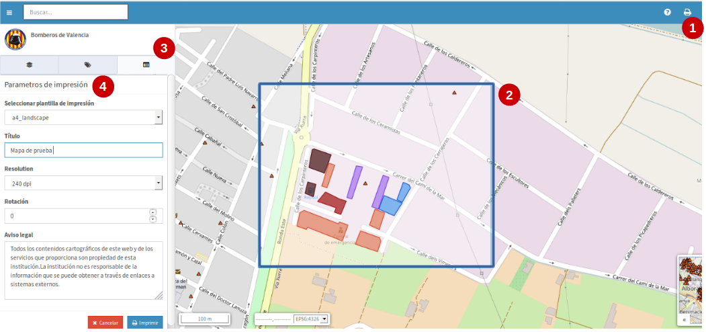
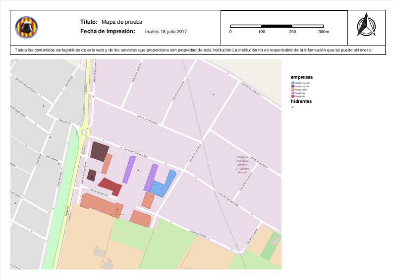

Imprimir mapa
=============

Desde el visor de proyectos se permite generar mapas de referencia de tamaño *'A3'* y *'A4'*. Estos mapas son ficheros que se descargan en formato '*pdf*'.

- Para usar esta opción se selecciona el botón de imprimir (**1**), éste se ubica en la esquina superior derecha de la barra de menú. 

- Sobre el área del mapa del visor, saldrá un recuadro azul (**2**) que representa el área de impresión seleccionada.

- Igualmente de forma automática, en la pestaña 'detalles' (**3**) del panel de contenidos, saldrá un formulario (**4**) para seleccionar y rellenar los parámetros de impresión.

   
- En las opciones de plantilla de impresión solo estarán disponibles el '*A3*' y '*A4*'

- El título del mapa puede ser personalizado por el usuario.

- Hay cuatro opciones para indicar la resolución en '*DPI*', son: 180, 240, 320 y 400.

- Se puede añadir un valor de rotación del mapa, esto se verá reflejado en la orintación del mismo, pero NO aplica para las etiquetas.

- En el aviso legal se puede añadir uno por defecto para todo el sistema, pero también se puede editar y personalizar por el usuario.

- Al finalizar los detalles de impresión, pinchamos sobre el botón azul 'imprimir' y se despliega la ventana para permitir la descarga, damos aceptar y se debe haber guardado en nuestro ordenador local el fichero '*pdf*', que por defecto tendrá el nombre: *"mapfish-print-report.pdf"*.

.. note::
   Es importante que para la descarga del pdf, el navegador web, debe tener activo la opción de ventanas emergentes.
   
- EL mapa de referencia descargado saldrá con el siguiente formato:

   
- La leyenda que saldrá en el mapa, serán las de todas aquellas capas que al momento de imprimir se encontraban activas en el proyecto.

- Finalmente se vuelve al visor de mapas y se hará clcik sobre el botón rojo *'cancelar'* para salir del área de impresión.
   
 
   