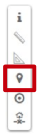
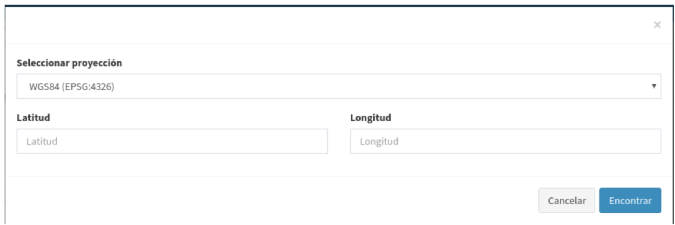

ºProcurar por coordenadas
======================
O modo de pesquisa inversa permite-nos procurar uma localização a partir de coordenadas dadas.

Para prosseguir com a pesquisa inversa, devemos primeiro seleccionar o sistema de referência no qual iremos introduzir as coordenadas. Os sistemas de coordenadas serão predefinidos para cada aplicação.

Uma vez seleccionado o sistema de coordenadas, introduziremos os valores de longitude e latitude se for um sistema com coordenadas geográficas ou X/Y.
no caso de um sistema com coordenadas projectadas.

