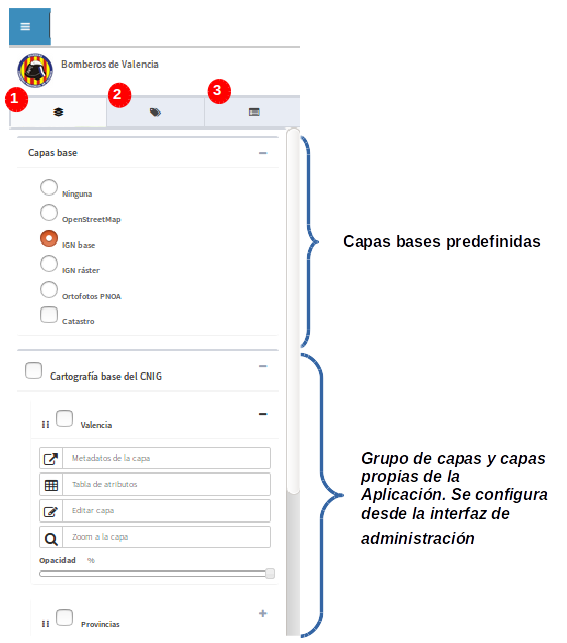
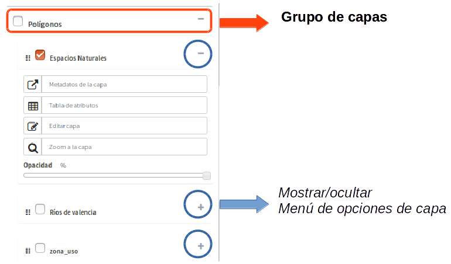

Introdução
============

O visualizador de mapas é a interface de visualização da plataforma que permite a visualização dos projetos configurados a partir do painel de controle.    

.. image:: ../images/viewer1.png
   :align: center

Consiste em uma série de componentes que estão localizados em uma área específica do site (Mapa, menu superior, painel de conteúdo, controles)

Mapa de localização 
----
O mapa é a área de exibição principal dos dados.

Ele contém uma série de controles localizados em diferentes áreas:

* Escala e posição no canto inferior esquerdo.

* Mapa de referência no canto inferior direito.

* Barra de controles na parte superior direita que agrupa os controles de zoom, medição, informação, localização, ...

Menu superior
-------------

.. image:: ../images/viewer0.png
   :align: center

* No menu superior encontramos primeiro o botão (**1**) que *permite mostrar ou ocultar o painel lateral de conteúdos*.

* **'Se o plugin de geocodificação estiver ativo** encontramos a caixa de pesquisa (**2**). A partir daqui poderemos encontrar localizações no mapa dependendo da configuração.

* Na parte direita do menu superior temos em primeiro lugar o botão (**3**) que nos mostra o manual gvsigOnline "**?**".
 
* Haverá também os botões de impressão (**4**).

* Finalmente encontramos o menu de sessão (**5**), desde o qual podemos mudar o idioma do sistema, fechar a sessão ou voltar ao painel de controle.

Painel de conteúdos
-------------------
O painel de conteúdo está localizado no lado esquerdo do visualizador e consiste em três abas:
 
- (**1**) a árvore de camadas, 
- (**2**) a legenda e 
- (**3**) resultados ou painel de 'detalhes'

A árvore de camada contém a hierarquia de camada que foi definida a partir da interface de administração para a aplicação em execução.

A árvore de camadas consiste em grupos de camadas e camadas. Os grupos de camadas são destinados a agrupar camadas que têm características comuns.

A estrutura em árvore pode ser dividida em 2 regiões:

*   **Camadas base:** Este grupo consiste em uma série de camadas base que são definidas no momento do desenvolvimento, ou seja, não podem ser administradas a partir da interface de administração. (OpenStreetMap, Bing, Google Maps, ortofotos locais, camadas cadastrais, etc.)

*   **As própias camadas de aplicação:** Consiste no resto de grupos de camadas que foram definidos corretamente para a aplicação que está sendo executada (camadas temáticas).

   
Todas as camadas (excepto as camadas de base predefinidas) têm um menu com uma série de acções disponíveis dependendo da configuração.

Para ver a legenda do mapa actual seleccione o separador *"Legenda"*" na barra de navegação. O painel de legenda mostra a legenda das camadas que estão ativas e visíveis no momento da consulta.

.. image:: ../images/legend.png
   :align: center