Controles do mapa
==================

Opacidade
--------
Para modificar a opacidade da camada, selecione o valor de opacidade desejado no controle deslizante do menu de ações da camada.

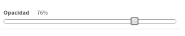

Zoom
----
Os comandos de zoom na barra de ferramentas permitem reduzir ou aumentar o zoom no mapa.

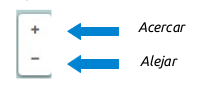

Medir distância
---------------
Esta ferramenta permite medir o comprimento entre dois ou mais pontos.

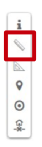

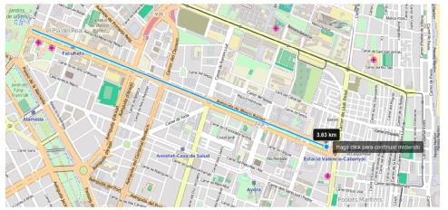

Medir área
----------
Esta ferramenta é utilizada para medir a área contida num polígono.

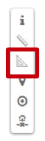

Para iniciar a medição, clique no ponto de origem e, em seguida, desenhe o resto dos pontos que definem a área a ser medida. Para terminar vamos clicar duas vezes no ponto que fecha o polígono.

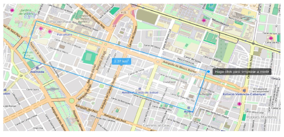

Posição atual 
---------------
Permite-lhe localizar a sua posição actual e centrar o mapa nela. Exige que aceitemos as permissões que o navegador nos solicitará.

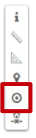

Escala numérica
---------------
Localiza-se na parte inferior esquerda do mapa.

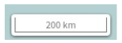

Posição del mouse
------------------
Exibe a posição do mouse no sistema de coordenadas selecionado.

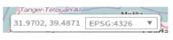

Pode alternar entre qualquer um dos sistemas de coordenadas configurados para a aplicação, seleccionando a partir do menu pendente.

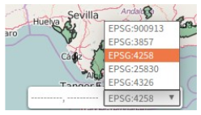

Mapa de referência
------------------
O mapa de referência está localizado no canto inferior direito do mapa, e nos permite manter uma referência de nossa posição quando estamos em níveis baixos de zoom.

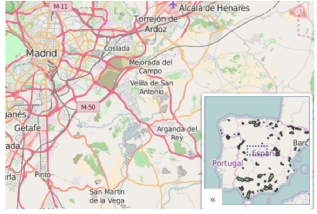