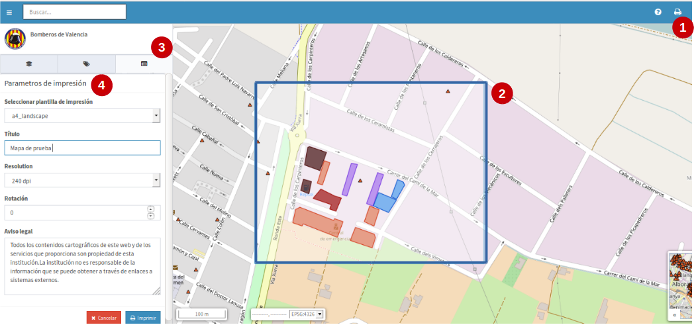
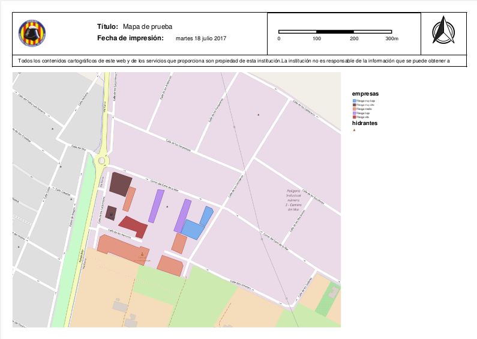

Imprimir mapa
=============

A partir do visualizador de projetos é possível gerar mapas de referência de tamanho *'A3'* e *'A4'*. Estes mapas são arquivos que são baixados no formato '*pdf*'. 

- Para utilizar esta opção, seleccione o botão de impressão (**1**), localizado no canto superior direito da barra de menus.  

- Uma caixa azul (**2**) aparecerá sobre a área do mapa do visualizador, representando a área de impressão selecionada.

- Também automaticamente, no separador 'detalhes' (**3**) do painel de conteúdos, haverá um formulário (**4**) para seleccionar e preencher os parâmetros de impressão.

   
- Apenas as opções '*A3*' e '*A4*' estarão disponíveis nas opções do modelo de impressão.

- O título do mapa pode ser personalizado pelo usuário.

- Existem quatro opções para indicar a resolução em '*DPI*', são elas: 180, 240, 320 e 400.

- É possível adicionar um valor de rotação do mapa, isto será refletido na orientação do mesmo, mas NÃO se aplica para as etiquetas.

- No aviso legal um pode ser adicionado por padrão para todo o sistema, mas também pode ser editado e personalizado pelo usuário.

- Ao final dos detalhes de impressão, clique no botão azul 'print' e a janela será exibida para permitir o download, aceitamos e devemos ter salvo em nosso computador local o arquivo '*pdf*', que por padrão terá o nome: *"mapfish-print-report.pdf" *.

.. nota::
   É importante que para descarregar o pdf, o navegador web deve ter a opção instantânea activa.
   
- O mapa de referência transferido aparecerá no seguinte formato:

   
- A legenda que aparecerá no mapa, será a de todas as camadas que no momento da impressão estavam ativas no projeto.

- Finalmente, volte ao visualizador de mapas e clique no botão vermelho *'cancelar'* para sair da área de impressão.
   
   
 
   