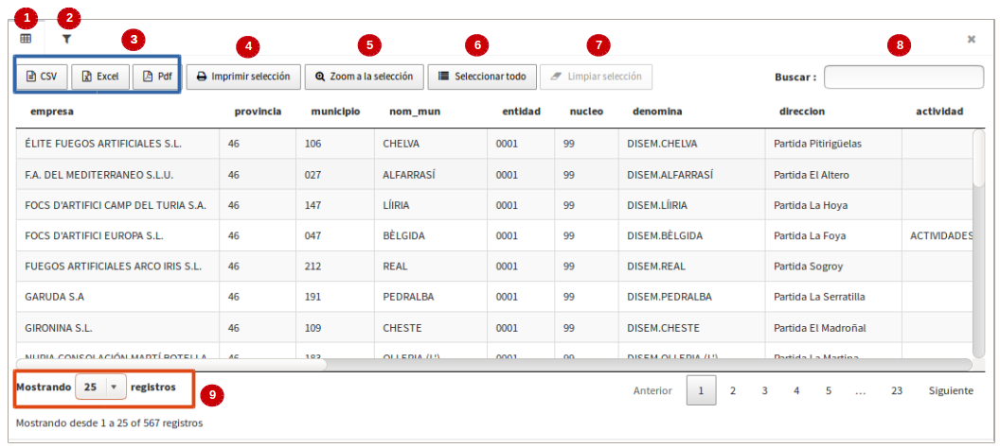
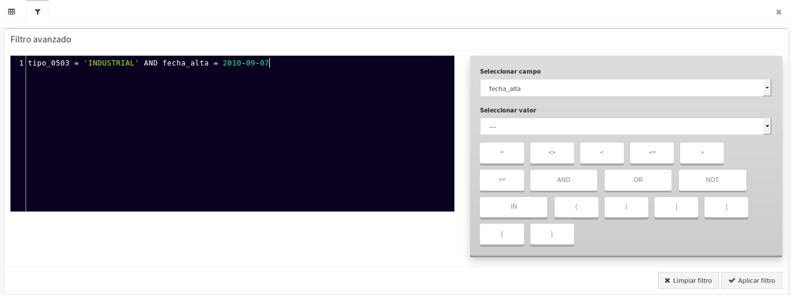

Mostrar tabela de atributos
==========================

Se a camada tiver uma fonte de dados vetorial, a ação *"Tabela de atributos "*" estará disponível. Selecionando a ação se abrirá uma janela contendo a tabela de atributos de camada.

Tabela de atributos
~~~~~~~~~~~~~~~~~~

A tabela de atributos oferece uma série de funcionalidades:

*   **Vista principal da tabela de atributos:** Ao seleccionar a opção 'Tabela de atributos', o seu separador principal (**1***) é apresentado por defeito a partir do qual pode utilizar as diferentes opções que oferece, bem como ver os registos que correspondem a cada uma das geometrias.

*   **Opções para exportar a tabela alfanumérica:** Existem três opções para exportar a tabela alfanumérica ou os registros selecionados. As opções permitidas são os seguintes formatos: '*CSV*', '*Excel*' e '*pdf*' (**3**).  Ao proceder à exportação serão descarregados apenas os registos que foram apresentados na página actual, ou seja, se na primeira página existirem 50 registos de um total de 25000 existentes, os 50 serão exportados. No combo para selecionar os registros exibidos (**9***) você pode indicar cada 10, 25, 50, 100, 500 e 1000, portanto, você poderá exportar até um máximo de 1000 registros por página da tabela. Se for aplicado um filtro e o resultado for, por exemplo, um total de 350 registos, pode escolher a opção 'mostrar até 500 regitros' e quando exportar os 350 registos será transferido na mesma vista.    

*   **Zoom à seleção:** (**5**), permite destacar no mapa os elementos associados aos atributos selecionados na tabela. Para utilizar esta opção deve primeiro seleccionar a(s) linha(s) uma a uma ou utilizar a opção "** Seleccionar tudo**" (**6**) e clicar no botão '*Zoom to selection*'. Para usar esta opción primero se debe sel. No mapa do visualizador, os elementos amarelos serão destacados e, para limpar a seleção no mapa, clique no botão *'Limpar mapa'* que está localizado nas ferramentas do lado direito do visualizador. 

*   **Limpar seleção:** (**7**), esta opção será ativada quando houver registros selecionados na tabela, portanto, como seu nome indica será utilizada para limpar ou desmarcar as linhas ativadas. É importante deixar claro que apenas desativar a seleção na tabela e NÃO no mapa, pois este último usará a ferramenta de visualização de 'Limpar mapa'.

*   **Imprimir Seleção:** (**4**), Esta opção permite imprimir um mapa junto com os registros alfanuméricos da tabela. Para esta opção será necessário: primeiro, selecionar as linhas da tabela, segundo, 'zoom à seleção' e finalmente '*seleção de impressão*'. Automaticamente você vai baixar um pdf que conterá na primeira página o mapa e na próxima página os registros dos elementos selecionados no mapa. Neste caso, o mapa mostrará apenas a legenda que corresponde à camada dos registos seleccionados. 

*   **Filtro da pesquisa rápida:** A tabela de atributos também oferece funcionalidade de pesquisa rápida. Para isso, introduza o modelo que pretende procurar na caixa de pesquisa (**8**). Automaticamente, a tabela será atualizada com os campos que atendem ao padrão de pesquisa entrado.

Filtro avançado
~~~~~~~~~~~~~~~

*   **Filtro avançado:** Para ir para a exibição de filtro avançado, você deve ativar a segunda guia da exibição principal da tabela de atributos (**2**). A partir desta vista pode compor as diferentes frases para aplicar um filtro na tabela. Para fazer a expressão você pode utilizar o auto-completar do campo e ao final clicar no botão '*aplicar filtro*' e mostrará a tabela de atributos com os registros encontrados. Para excluir o filtro, volte para a guia '*filtro*' e clique em '*Limpar filtro*'.

