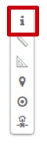
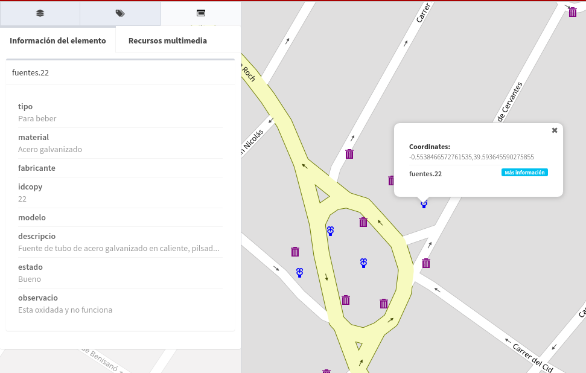

Informação no ponto
=======================

A ferramenta de informação no ponto, nos permite obter a informação em uma determinada coordenada das camadas que são visíveis.

Para obter a informação no ponto selecionamos a ferramenta e clicamos no mapa no local desejado.

Mostrará um popup nas coordenadas selecionadas onde aparecerá uma lista de elementos que se interceptam.

Se quisermos estender a informação, seleccionaremos o elemento e este mostrará a informação estendida no painel de resultados.

   
Além disso, se o item selecionado tiver recursos multimídia associados (imagens, documentos, ...), eles podem ser visualizados na guia *"Recursos multimídia"*".

.. image:: ../images/info3.png
   :align: center